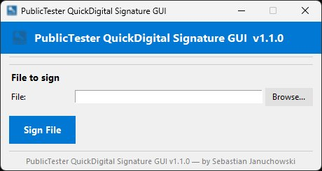

# PublicTester QuickDigital Signature GUI

<p align="center">
  
  
  
  
</p>

> Graficzny interfejs (GUI) do podpisywania cyfrowego plików przy użyciu narzędzia **SignTool.exe** z Windows SDK. Umożliwia proste i szybkie podpisywanie plików `.exe`, `.dll`, `.msi` i innych za pomocą certyfikatu `.pfx`.

---

## 📋 Spis treści

- [Opis](#-opis)
- [Zrzuty ekranu](#-zrzuty-ekranu)
- [Wymagania](#-wymagania)
- [Instalacja](#-instalacja)
- [Użycie](#-użycie)
- [Struktura projektu](#-struktura-projektu)
- [Konfiguracja](#-konfiguracja)
- [FAQ](#-faq)
- [Autorzy](#-autorzy)
- [Licencja](#-licencja)

---

## 📖 Opis

**PublicTester QuickDigital Signature GUI** to lekka aplikacja desktopowa napisana w Pythonie (Tkinter), która stanowi przyjazny interfejs do narzędzia `signtool.exe` z pakietu Windows SDK.

Główne funkcje:

- 🔍 **Automatyczne wykrywanie `signtool.exe`** — przeszukuje katalog programu, zasoby PyInstaller oraz standardowe ścieżki Windows SDK (8.0, 8.1, 10, 11).
- 📂 **Automatyczne wykrywanie certyfikatów `.pfx`** — skanuje katalog programu, podkatalog `certs/`, profil użytkownika i inne standardowe lokalizacje Windows.
- 🔐 **Obsługa hasła PFX** — opcjonalne pole hasła do chronionego certyfikatu.
- 🕐 **Znacznik czasu** — automatycznie dodawany z serwera `timestamp.digicert.com` (SHA-256).
- 🖥️ **Minimalistyczny UI w stylu Microsoft Fluent** — niebieski nagłówek (`#0078D4`), czysty układ, komunikaty statusu.
- 📦 **Obsługa PyInstaller** — działa zarówno jako skrypt `.py`, jak i spakowany `.exe`.

---

## 🖼️ Zrzuty ekranu

<p align="center">
  
</p>

---

## ✅ Wymagania

| Zależność | Wersja minimalna | Uwagi |
|-----------|-----------------|-------|
| Python | 3.10+ | Wymagana składnia `X \| Y` dla typów |
| Pillow | 9.0+ | `pip install Pillow` |
| tkinter | wbudowany | Standardowy moduł Pythona |
| signtool.exe | dowolna | Z Windows SDK lub w katalogu programu |
| Windows | 10 / 11 | Wymagany system Windows |

> **Uwaga:** Aplikacja działa wyłącznie na systemie **Windows**. Narzędzie `signtool.exe` nie jest dostępne na Linux/macOS.

---

## 🚀 Instalacja

### Metoda 1 — uruchomienie z kodu źródłowego

```bash
# 1. Sklonuj repozytorium
git clone https://github.com/TwojaOrganizacja/quickdigital-signature-gui.git
cd quickdigital-signature-gui

# 2. Zainstaluj zależności
pip install Pillow

# 3. Uruchom aplikację
python main.py
```

### Metoda 2 — pakowanie do pliku EXE (PyInstaller)

```bash
pip install pyinstaller

pyinstaller --onefile --windowed --icon=app_icon.ico ^
  --add-data "app_icon.ico;." ^
  --add-data "certs;certs" ^
  main.py
```

Gotowy plik `.exe` znajdziesz w katalogu `dist/`.

### Metoda 3 — gotowy plik EXE

Pobierz najnowszy release ze strony [Releases](../../releases) i uruchom `QuickDigitalSignature.exe` bezpośrednio — bez instalacji Pythona.

---

## 🖱️ Użycie

1. **Uruchom aplikację** (`python main.py` lub `QuickDigitalSignature.exe`).
2. **Certyfikat** — aplikacja automatycznie znajdzie pliki `.pfx` w katalogu programu lub w podkatalogu `certs/`. Możesz też kliknąć **Browse...** i wybrać własny folder.
3. **Hasło PFX** — wpisz hasło, jeśli certyfikat jest zabezpieczony. Pozostaw puste, jeśli nie ma hasła.
4. **Plik do podpisania** — kliknij **Browse...** i wybierz plik (`.exe`, `.dll`, `.msi`, `.cab`, itp.).
5. **Podpisz** — kliknij przycisk **Sign File**. Wynik pojawi się w oknie dialogowym.

### Lokalizacje certyfikatów przeszukiwane automatycznie

| Priorytet | Lokalizacja |
|-----------|-------------|
| 1 | Zasoby wewnętrzne PyInstaller (`_MEIPASS`) |
| 2 | Katalog programu (obok `.exe`) |
| 3 | `<katalog programu>\certs\` |
| 4 | `%USERPROFILE%\.certificates\` |
| 5 | `%USERPROFILE%\certificates\` |
| 6 | Pulpit użytkownika |
| 7 | `%APPDATA%\certificates\` |
| 8 | Publiczny pulpit (`%PUBLIC%\Desktop`) |
| 9 | Folder podany ręcznie |

---

## 📁 Struktura projektu

```
quickdigital-signature-gui/
├── main.py              # Główny plik aplikacji
├── app_icon.ico         # Ikona aplikacji (opcjonalna)
├── certs/               # Opcjonalny katalog na certyfikaty .pfx
│   └── *.pfx
├── requirements.txt     # Zależności Pythona
├── README.md            # Ten plik
└── dist/                # Skompilowany .exe (po uruchomieniu PyInstallera)
```

---

## ⚙️ Konfiguracja

Stałe konfiguracyjne na początku pliku `main.py`:

```python
APP_NAME    = "PublicTester QuickDigital Signature GUI"
APP_VERSION = "1.1.0"
APP_AUTHOR  = "PublicTester QuickDigital Signature"

MINIMAL_GUI = True   # True = ukrywa zaawansowane sekcje UI
```

Ustawienie `MINIMAL_GUI = False` włącza dodatkowe elementy interfejsu (sekcja certyfikatów, status SignTool, selektor katalogu certyfikatów).

**Serwer znacznika czasu** (domyślny):
```
http://timestamp.digicert.com
```
Aby zmienić serwer, edytuj wartość `/tr` w funkcji `uruchom_signtool()`.

---

## ❓ FAQ

**Q: Pojawia się błąd „SignTool.exe not found".**  
A: Zainstaluj [Windows SDK](https://developer.microsoft.com/windows/downloads/windows-sdk/) lub umieść plik `signtool.exe` w tym samym katalogu co `main.py` / `.exe`.

**Q: Błąd „No .pfx certificates found".**  
A: Umieść plik `.pfx` w katalogu obok aplikacji lub w podkatalogu `certs/`, ewentualnie kliknij **Browse...** i wskaż właściwy folder.

**Q: Czy aplikacja działa na Windows 7 / 8?**  
A: Oficjalnie wspierane są Windows 10 i 11. Na starszych systemach aplikacja może działać, lecz nie jest to testowane.

**Q: Czy mogę podpisać kilka plików naraz?**  
A: Obecna wersja obsługuje jeden plik na raz. Wsparcie dla podpisywania wsadowego planowane jest w v1.2.0.

---

## 👤 Autorzy

| Autor | Rola |
|-------|------|
| **Sebastian Januchowski** | Twórca i główny deweloper |

---

## 📄 Licencja

Projekt jest udostępniony na licencji **MIT**. Szczegóły w pliku [LICENSE](LICENSE).

```
MIT License

Copyright (c) 2024 Sebastian Januchowski

Permission is hereby granted, free of charge, to any person obtaining a copy
of this software...
```

---

<p align="center">
  Stworzono z ❤️ przez <strong>Sebastian Januchowski</strong> · PublicTester QuickDigital Signature
</p>
