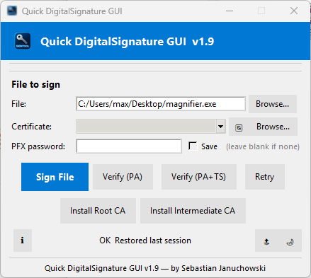

# Quick DigitalSignature GUI

> **A lightweight Windows GUI for signing and verifying executables with Microsoft SignTool**



[](https://github.com/seb07uk)
[](https://github.com/seb07uk)
[](https://www.python.org)
[](https://github.com/seb07uk)

---

## Overview

**Quick DigitalSignature GUI** is a user-friendly graphical front-end for Microsoft's `SignTool.exe`. It enables developers and system administrators to sign Windows binaries (`.exe`, `.dll`, `.msi`, `.cab`) with a PFX certificate — and verify existing signatures — without needing to remember complex command-line syntax.

**Author:** Sebastian Januchowski  
**Company:** polsoft.ITS™ Group  
**Contact:** polsoft.its@fastservice.com  
**Website:** https://github.com/seb07uk  
**Copyright:** 2026 © polsoft.ITS™. All rights reserved.

---

## Features

| Feature | Description |
|---|---|
| 🖊️ **Sign Files** | Sign any Windows binary with a PFX certificate using SHA-256 |
| ✅ **Verify (PA)** | Verify a signature against the local certificate store (policy-based) |
| ✅ **Verify (PA+TS)** | Verify signature **and** RFC 3161 timestamp against an online authority |
| 🔁 **Retry** | Repeat the last Sign or Verify operation instantly |
| 🔒 **Secure Password** | Save PFX password encrypted via Windows DPAPI (per-user, per-machine) |
| 📂 **Auto-scan Certificates** | Automatically discovers `.pfx` files in the program directory and `certs/` subfolder |
| 🖱️ **Drag & Drop** | Drag any file directly onto the window to select it |
| 🏛️ **Install Root CA** | Install a root certificate into the system's Trusted Root store |
| 🏛️ **Install Intermediate CA** | Install an intermediate certificate into the CA store |
| 🌙 **Dark / Light Theme** | Toggle between light and dark UI themes; preference is saved |
| 🔝 **Always on Top** | Pin the window above all other windows |
| 📋 **Session Restore** | Remembers the last used file and certificate between sessions |
| 📝 **Rotating Log** | Writes a rotating `app.log` for troubleshooting (max 1 MB × 5 backups) |

---

## Requirements

- **OS:** Windows 10 / Windows 11 (64-bit recommended)
- **Python:** 3.8 or later (if running from source)
- **SignTool.exe** — one of:
  - Bundled inside the packaged EXE (if distributed that way)
  - Placed in the same folder as the application
  - Installed via [Windows SDK](https://developer.microsoft.com/en-us/windows/downloads/windows-sdk/)
  - Available on the system `PATH`
- **Python dependencies** (source only):
  ```
  Pillow
  tkinterdnd2
  ```

---

## Installation

### Option A — Pre-built EXE (recommended)

1. Download the latest `QuickDigitalSignature.exe` from [Releases](https://github.com/seb07uk).
2. Place it in any folder together with your `.pfx` certificates (or a `certs/` subfolder).
3. Double-click to run — no Python installation required.

### Option B — Run from Source

```bash
# Clone or download the repository
git clone https://github.com/seb07uk/quick-digitalsignature

# Install dependencies
pip install Pillow tkinterdnd2

# Run
python Quick_DigitalSignature.py
```

---

## Usage

### Signing a File

1. **File** — Click **Browse…** or drag-and-drop your target binary.
2. **Certificate** — Select a `.pfx` from the dropdown or click **Browse…** to choose one manually.
3. **PFX Password** — Enter the certificate password (leave blank if none). Check **Save** to store it securely.
4. Click **Sign File**.
5. On success, a confirmation dialog shows the SignTool output.

### Verifying a Signature

- **Verify (PA)** — Checks the digital signature against the local certificate store.
- **Verify (PA+TS)** — Additionally validates the RFC 3161 timestamp via an online authority.

### Installing Certificates

If verification fails with *"root certificate not trusted"*:

1. Click **Install Root CA** and select your root `.cer` / `.crt` file.
2. If applicable, click **Install Intermediate CA** for any intermediate certificate.

> **Note:** Installing into the Local Machine store requires Administrator privileges. Without elevation the certificate is installed in the Current User store only.

---

## Configuration & Logs

| Item | Location |
|---|---|
| Config file | `%APPDATA%\QuickDigitalSignature\config.json` |
| Log file | `%APPDATA%\QuickDigitalSignature\app.log` |

The application automatically saves and restores:
- Last used file path
- Last used certificate
- Encrypted PFX password (if **Save** is checked)
- UI theme preference

---

## Troubleshooting

**SignTool.exe not found**
Place `signtool.exe` in the same folder as the application, or install the Windows SDK and ensure its `bin\<version>\x64\` path is on your `PATH`.

**Signature verification fails (untrusted root)**
Import the signing chain certificates using **Install Root CA** and **Install Intermediate CA**, or via:
```powershell
Import-Certificate -FilePath root.cer    -CertStoreLocation Cert:\LocalMachine\Root
Import-Certificate -FilePath inter.cer   -CertStoreLocation Cert:\LocalMachine\CA
```

**Password save is greyed out**
Windows DPAPI is not available on this machine or user session. Enter the password manually each time.

---

## License

Copyright © 2026 polsoft.ITS™. All rights reserved.  
Unauthorized copying, distribution, or modification is prohibited without written permission.
